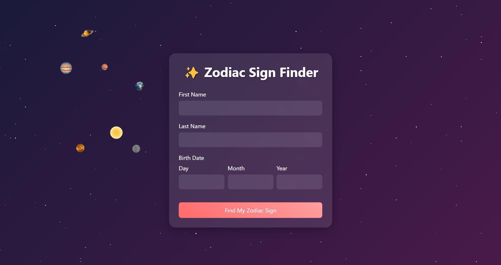

# AstroPlanet - The Astrology App 🌟

AstroPlanet is an interactive web application that combines astrology with stunning visual elements to create an engaging user experience. The app features a dynamic solar system animation, zodiac sign calculator, and personalized astrological readings.

## 🔗 Live Demo

Experience the app live: [AstroPlanet Live Demo](https://gptshubham.github.io/the_astrology_app_js/)

## ✨ Features

- **Interactive Zodiac Sign Finder**

  - Calculate your zodiac sign based on birth date
  - Receive personalized readings and recommendations
  - Beautiful form animations and transitions

- **Dynamic Solar System**

  - Animated planets orbiting around the sun
  - Realistic orbital speeds and movements
  - Responsive scaling for different screen sizes

- **Ambient Star Background**

  - Dynamic twinkling star effect
  - Randomly generated star positions
  - Smooth animation transitions

- **Modern UI/UX**
  - Glassmorphism design elements
  - Responsive layout for all devices
  - Smooth loading transitions
  - Interactive form elements

## 🚀 Technologies Used

- HTML5
- CSS3 (Animations & Flexbox)
- Vanilla JavaScript
- ES6+ Features
- Mobile-First Design

## 🌐 Deployment

The project is deployed using GitHub Pages. You can access the live version at: [https://gptshubham.github.io/the_astrology_app_js/](https://gptshubham.github.io/the_astrology_app_js/)

## 💻 Usage

1. Enter your first and last name
2. Input your birth date (day, month, and year)
3. Click "Find My Zodiac Sign"
4. View your personalized astrological reading and recommendations

## 📱 Responsive Design

The application is fully responsive and works on:

- Desktop devices
- Tablets
- Mobile phones

## ⚙️ Technical Details

### Key JavaScript Features

- Form validation with date verification
- Dynamic content generation
- Smooth animations and transitions
- Random message selection algorithms
- Interactive UI elements

### CSS Highlights

- Custom keyframe animations
- Glassmorphism effects
- Responsive grid layouts
- Dynamic star generation
- Planetary orbit animations

## 🤝 Contributing

Pull requests are welcome. For major changes, please open an issue first to discuss what you would like to change.

## 📜 License

[MIT](https://choosealicense.com/licenses/mit/)

## 👨‍💻 Developer

Developed as part of the NEXUS+ Web Development course.

- Developer: Shubham Kumar Gupta

## 🌟 Acknowledgments

- Special thanks to Rohit Negi for mentorship and guidance
- Inspired by modern astrological applications
- Built with passion for web development

---

⭐ Don't forget to star this repo if you found it helpful!
